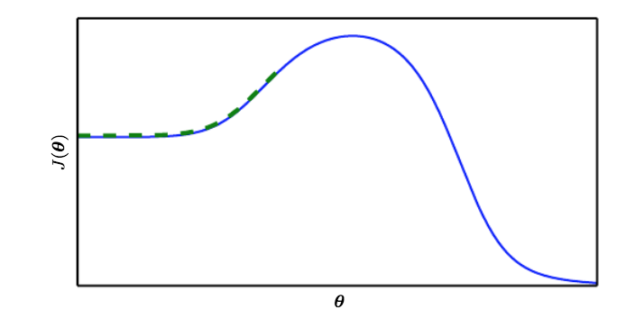

# Ch8: Optimization for Deep Learning

#### Introduction
- Overall goal: find parameters $\theta$ of a neural network that optimize a defined cost function $J(\theta)$
  - $J$ is generally some quantification of our "performance" over teh training data as well as additional regularization terms
- In actuality, we'd like to minimize $$J(\theta) = \mathbb{E}_{(x,y) \tilde{} p_{data}} L(f(x;\theta), y) = \int_{(x, y) \in{D}}{L(f(x;\theta), y)p(x,y)}$$ 
  - This is the loss across the entire data generating distrbution, and is intractable, since we don't have access to the data generating distribution
  - This quantity is also known as the "risk"

#### Empirical Risk Minimization

- We approximate the above quantity by minimizing across the training data: $$\frac{1}{m}\sum_{i=1}^{m} L(f(x_i;\theta), y_i)$$ 
  - This is known as the empirical risk, since it is computed across the data we have observed, which is a subset of the actual data
    - We can show that the expectation of the empirical risk across the data generating distribution: $$\mathbb{E}_D[\frac{1}{m}\sum_{i=1}^{m} L(f(x_i;\theta), y_i)] = \frac{1}{m}\mathbb{E_D}\sum_{i=1}^{m} L(f(x_i;\theta), y_i)$$ 
    - By linearity of expectation, we have $$\frac{1}{m}\sum_{i=1}^{m}\mathbb{E_D}[ L(f(x_i;\theta), y_i)]$$ 
    - Since we use IID assumptions, this is the same as calculating the expectation for any sample from the data generating distribution: $$\frac{1}{m}\sum_{i=1}^{m}\mathbb{E_D}[ L(f(x;\theta), y)]$$, making the sum term the same as the true risk.
    - This result provides us some assurance that empirical risk minimization is a good strategy to also approximate minimizing the true risk, though we can also show that there exist learners for which the true risk is $1$ and the empirical risk is $0$. 
- If $$L$$ is the 0-1 loss, then we generally cannot use this function directly, since optimizing on it is intractable.
- To work around this, a **surrogate loss function** is often used, such as the negative log-likelihood, as an approximation for the 0/1 loss.
- We can also compute the 0/1 loss across validation data during training, and when it stops decreasing it may be an indication for early stopping.

#### Batch/minibatch learning

- If we formulate our loss and gradient as the expectation across the # of training examples, this will be expensive, due to large training set sizes
- Using batches of smaller size is faster, and provides many advantages:
  - Accuracy of the gradient is not too much worse- the standard error of the mean is $\frac{\sigma}{\sqrt(n)}$  , meaning that there is less than a linear improvement in the gradient accuracy with more samples. 
  - Minibatch learning accounts for redundancy and introduces more stochasticity into the  model, has a regularizing effect
  - If examples are not repeated, then it can be shown that minibatch SGD provides an unbiased estimate of the gradient of the *generalization error* - see pg. 278 of the DLB for a derivation of this.
- If you have smaller batches, you may want to use a smaller learning rate, since the gradient has more variability, and you are "less confident" about taking a larger step in that direction.

#### Issue w/Optimization: Ill-Conditioning

- Said to happen when the Hessain $H$ is large compared to the gradient norm, and even a very small step in the direction of the gradient would actually increase the cost function rather than decreasing it as desired
- How to find ill conditioning: the Taylor series expansion. Recall that we can have a 2nd order approximation of $f$ at $x_0$: $f(x) \approx f(x_0) + f'(x_0)(x - x_0) + \frac{1}{2}f''(x_0)(x-x_0)^2$. If we let $\textbf{g}$  denote the first derivative and $\textbf{H}$ denote the 2nd derivative, then we have $f(x)\approx f(x_0) + (x-x_0)\textbf{g} + \frac{1}{2}(x-x_0)^T\textbf{H}(x-x_0)$. where $x$ and $x_0$ are now vector-valued.
- The normal gradient descent update would give us $$f(x_0-\epsilon g) \approx f(x_0) + (x_0 - \epsilon g - x_0)g + \frac{1}{2}(x_0 - \epsilon g - x_0)^T\textbf{H}(x_0 - \epsilon g - x_0) $$ $$ = f(x_0) -\epsilon g^Tg+\frac{1}{2}\epsilon^2g^T\textbf{H}g $$
- For gradient descent to give us a smaller value for $f$, we require  $$-\epsilon g^Tg+\frac{1}{2}\epsilon^2g^T\textbf{H}g < 0$$ or $$\epsilon g^Tg > \frac{1}{2}\epsilon^2g^T\textbf{H}g$$. This tells us that if the Hessian gets too large, then the right hand term may be greater than the left hand term, and thus gradient descent won't actually reduce our cost function.
  - If we note that during training the $$g^T\textbf{H}g$$ term is getting much larger than the $$g^Tg$$ term, we could further scale the learning rate to keep the right hand term smaller.  
    - Again, as with most methods using the Hessian, this is not very practical since computing the Hessian is usually prohibitively expensive.

#### Issue w/Optimization:  Saddle Points/Local Minima

- Since neural networks lead to the optimization of highly nonconvex loss functions, optimization algorithms could potentially converge to a local minima with a significantly higher cost than the global minima
- Can test if local minima is a problem in model training by plotting the norm of the gradient —> it was shown that local minima is usually not the problem, since the norm of the gradient is still quite large when convergence occurs, whereas if it was local minima then the gradient would be about 0. 
- **Saddle points** are points with $0$ gradient, but these points are neither a local min or local max
- We can use a generalization of the 2nd derivative test through examining the eigenvalues of the Hessian
- When $\nabla_xf(x) = 0$ and the Hessian is positive definite (all eigenvalues > 0 at that point), then we're at a local min, since the 2nd directional derivative is everywhere positive, and the grad is 0
- Similarly, when the Hessian is negative definite (all eigenvalues < 0) then we're at a local max
- If it's neither, then we're at a saddle point
- Notion of **convexity** - central to traditional machine learning loss functions - the Hessian needs to be everywhere positive semidefinite, meaning that we should be able to show for a Hessian $H$ and any real vector $z$, $z^T H z > 0$. 
- Saddle points are generally problematic for 2nd order optimization algorithms - such as Newton's method, which is only designed to jump to a point with 0 gradient, so it may jump to a saddle point
  - Modifications such as "Saddle-free Newton's method" exists to accomodate for this
- Aside: main idea for "escaping" saddle points:
  - If you have a saddle point that is "well-behaved", then you can possibly use 2nd order methods to escape the saddle points. For example, if you are at or near a point where $\nabla_{x} f(x) = 0$, but the Hessian is not positive definite or negative definite, then you may be at a saddle point. If you can find a direction $u$ (a directional vector) such that $u^THu < 0$, then this indicates that the update $x = x - \epsilon u$ would decrease the value of the objective, and push you out of the saddle point. We can see this with the Taylor series expansion:
    - $$f(x-\epsilon u) \approx f(x) + \nabla_xf(x)(x - \epsilon u - x) + \frac{1}{2}(x - \epsilon u - x)^T\nabla^2f(x)(x - \epsilon u - x)$$ 
    - Which becomes, since we are assuming $\nabla_x f(x)= 0$, $$f(x) - \frac{1}{2}\epsilon u^T\nabla^2f(x)(-\epsilon)u = f(x) + \frac{1}{2}\epsilon^2u^T\nabla^2f(x)u$$ which is less than $$f(x)$$. 
  - This is harder if we don't have access to 2nd order information - which is usually the case since the 2nd order derivative is expensive to compute and is of quadratic size in the dimension of the optimizaiton problem. In these cases, we normally rely on stochastic/perturbed gradient descent which produces a noisy estimate of the gradient, which has been shown to help escape saddle points.

#### Issue w/Optimization: Cliffs/Exploding Gradients

- The loss function surface may have large step-function like increases, leading to large gradients. But since the gradient is generally used for the direction of steepest descent and not necessarily the amount to step, we can accomodate for large gradients by imposing a gradient clipping rule. This preserves direction but decreases magnitude.

#### Issue w/Optimization: Long-term dependencies

- The vanishing/exploding activations/gradient problem:
  - Consider a deep feedforward network that just successively multiplies its input by a matrix $W$ $t$ times. If $W$ has an eigendecomposition $W = V\mathbb{diag}(\lambda)V^{-1}$ then $W^t = V\mathbb{diag}(\lambda)^tV^{-1}$, so unless the eigenvalues are all around an absolute value of $1$, we will have the vanishing/exploding activation problem, and the gradient propagating backwards scales similarly. 
  - Research into this problem has yielded several techniques, most notably Batch Normalization and weight initialization schemes such as He & Xavier initialization to ensure that activation and gradients have healthy norms throughout the training process. The central idea revolves around ensuring that the variances between successive layers stays at $1$ instead of converging to $0$. 
  - Gradient clipping, especially in RNNs, has been shown to alleviate the exploding gradient problem - the gradient is thought of more as a direction to travel in in the optimization landspace, and not necessarily the amount to travel. LSTM cells also largely avoid the exploding gradient problem.

#### Issue w/Optimization: Poor Correspondence Between Local & Global Structure

- Being initialized on "the wrong side of the mountain":

  

- Many loss functions don't have an absolute difference - consider the softmax loss function that measures the cross entropy between the labels' distribution and your predictions' distribution - it can never truly reach 0, but it can get arbitrarily close as the classifier gets more and more confident about its predictions.

- Overall, its important to try to choose a good initialization scheme, and possibly try several different random initializations, train the model, and pick the one that did the best.

#### Basic Algorithms

- **Stochastic Gradient Descent**

  - It is possible to obtain an unbiased estimate of the gradient by computign the average gradient on a minibatch of samples drawn IID from the data generating distribution

  - In practice, it is important to decay the learning rate while training. For example, a linear decay schedule could be:

    ​	$$ \epsilon_k = (1 - \alpha) e_k + \alpha\epsilon_T$$ where $$ \alpha = \frac{k}{t} $$

    - This essentially linearly decreases the learning rate until iteration $$T$$ at which point it is common to keep the learning rate constant

  - This is necessary since SGD provides a noisy estimate of the gradient. Near the local minimum or at the local minimum, the true gradient will be really small (or $$0$$ for at the local minimum), so we want to intuitively decay the learning rate to have less noise in our parameter updates.

    - Kind of indicates how much we trust the magnitude of the gradient along with the direction of the gradient. In the beginning, we're fine with large gradients since we have large errors and want to train faster, but at the local minimum, we know the correct direction to travel in but want to be more sure about how much we step in that direction.

  - Advice for choosing a learning rate: best to do by monitoring learning curves that show the loss across time for the first few hundred iterations. 

    - If the curve shows violent oscillations, then the LR might be too large.
    - If initial learning rate is too small, learning will either commence very slowly or the objective function will become stuck at a high value
    - Generally the best LR is the one that results in a slightly higher cost than the learning rate that reduces the objective function the most in the first hundred or so iterations.

  - SGD has the nice property that the time to compute and apply an update does not increase with the size of the training dataset, wheras the time increases linearly for standard batch gradient decent

    - since the gradient (in batch) needs to compute the gradient for all the training samples

  - Also, SGD can often make good rapid initial progress, rapid because it does not need to compute the gradient across all samples

  - But what about SGD convergence? What are our convergence guarantees for SGD as compared to batch gradient descent?

    - For a strongly convex problem, the *excess error* of using SGD, or $$ J(\theta) - min_{\theta} J(\theta)$$ has been shown to be $$ O(\frac{1}{k}) $$ after $$ k $$ iterations, 
    - Cramer-Rao bound: The generalization error cannot decrease faster than $$ O(\frac{1}{k}) $$, so this means that its not worth it to seek a faster convergence algorithm than SGD: it won't decrease the generalization error, meaning that any improved convergence would likely contribute to overfitting

  #### Momentum

  - Main idea with momentum: maintain (an exponentially decaying) moving average of past gradients and continue to move in their direction, in addition to the direction given by the current gradient

    - Basically results in updates having a large influence on the past gradients, which hopefully have a trajectory towards the local minimum. Useful in regions of high curvatures, where using the gradient at only that point may result in a misstep

  - Momentum update rule:

    - Initialize $$ v = 0 $$ which will hold an exponentially decaying moving average of past gradients
    - $$ v \leftarrow{} \alpha v - \epsilon_tg $$  where $$ g $$ is the gradient, $$ \alpha $$ is the momentum constant. $$\alpha$$ is generally set to be $$ 0.9$$ and it is not uncommon to increase the value throughout training. Intuitively, it says how much of the update should be decided by previous gradient values and current gradient values. In cases of high curvature, noisy gradients, or at the local minumum when we want to be more sure about our steps, may be better to have a higher alpha and more influence from previous gradients.
    - Actual update: $$\theta \leftarrow{} \theta + v $$

  - Now, step size doesn't depend on only the value of the gradient at that point, but how large and aligned a sequence of previous gradients were

    - Gradient would be largest when they're all large gradients that point in the same direction, smallest when all gradients point in different (and opposite/cancelling) directions

    ​

